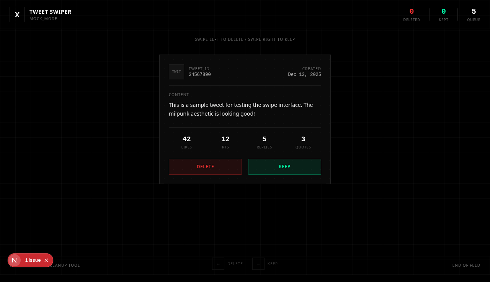
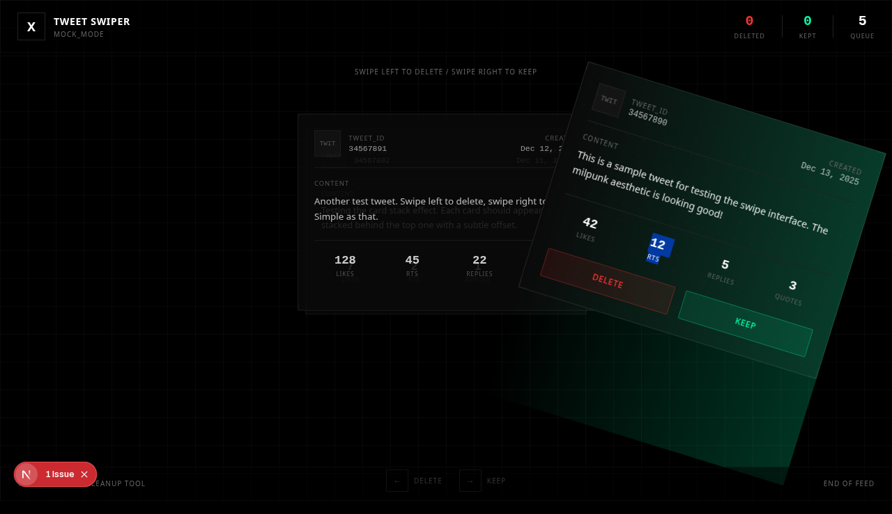

# Tweet Swiper (ex-my-x)

A Tinder-style tweet deletion app. Swipe left to delete, swipe right to keep.



## Features

- **Swipe Interface**: Drag cards left/right or use buttons to delete/keep tweets
- **Card Stack**: Visual deck effect showing upcoming tweets
- **Auto-load**: Fetches more tweets when queue runs low
- **Mock Fallback**: Works with demo data when Twitter API is unavailable
- **Milpunk Design**: Minimal, military-inspired aesthetic

## Screenshots

| Swipe Left (Delete) | Swipe Right (Keep) |
|---------------------|-------------------|
|  |  |

## Getting Started

```bash
# Install dependencies
bun install

# Set up environment variables
cp .env.example .env
# Edit .env with your Twitter API credentials

# Run development server
bun dev
```

Open [http://localhost:3000](http://localhost:3000) in your browser.

## Environment Variables

Create a `.env` file with:

```env
X_API_KEY=your_api_key
X_KEY_SECRET=your_api_secret
X_AUTH_ACCESS=your_access_token
X_AUTH_ACCESS_TOKEN_SECRET=your_access_token_secret
```

Get these from the [Twitter Developer Portal](https://developer.x.com/en/portal/dashboard):
- **API Key & Secret**: Keys and Tokens → Consumer Keys
- **Access Token & Secret**: Keys and Tokens → Access Token and Secret (click Generate)

## Docker

### Using Docker Compose (recommended)

```bash
# Build and run
docker compose up -d

# View logs
docker compose logs -f

# Stop
docker compose down
```

### Using Docker directly

```bash
# Build
docker build -t tweet-swiper .

# Run
docker run -p 3000:3000 \
  -e X_API_KEY=your_api_key \
  -e X_KEY_SECRET=your_api_secret \
  -e X_AUTH_ACCESS=your_access_token \
  -e X_AUTH_ACCESS_TOKEN_SECRET=your_access_token_secret \
  tweet-swiper
```

The app will be available at [http://localhost:3000](http://localhost:3000).

## API Endpoints

- `GET /api/tweets` - Fetch user's tweets with pagination
- `DELETE /api/tweets` - Delete a specific tweet
- `GET /api/user` - Get current authenticated user info

## Tech Stack

- **Framework**: Next.js 16
- **Runtime**: Bun
- **Styling**: Tailwind CSS v4
- **Twitter**: twitter-api-v2
- **Testing**: Playwright

## Testing

```bash
# Run all tests
bunx playwright test

# Run with UI
bunx playwright test --ui
```

## Project Structure

```
src/
  app/
    api/
      tweets/route.ts  # Tweet CRUD operations
      user/route.ts    # User info endpoint
    page.tsx           # Main swipe interface
    globals.css        # Milpunk styling
  components/
    TweetCard.tsx      # Swipeable card component
  lib/
    twitter.ts         # Twitter client & types
```

## Design Reference

Styling based on the milpunk aesthetic from Andreas Labs - minimal borders, monospace fonts, uppercase tracking, and dot grid patterns.
